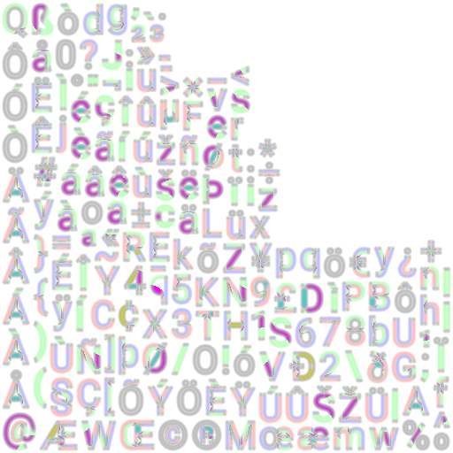
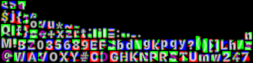
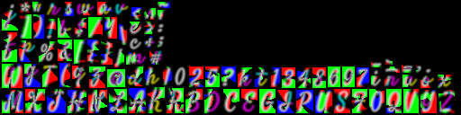

## Bitmap font generator for msdf-gdx
This is a small utility used to create SDF, MSDF and MSDFA bitmap font files from `.ttf` files.
The generated `.fnt` files uses libGDX's format. 

Here's what you need to download:
- The latest version of Chlumsky/msdfgen can be found **[here][msdfgen]**.
- The utility jar file can be found in the **[releases][releases]**.

Place them both in the same directory.

### Usage
The jar file can be run with:
```text
java -jar msdfgen.jar [options] <font-file>
```
You can also use a configuration file `config.txt` with:
```text
java -jar msdfgen.jar @config.txt 
```
The CLI expects at least one parameter specifying the `.ttf` font file, 
but there can be more than one.

#### Options
- **-g**, **--msdfgen**: Path of the msdfgen executable. Default: `msdfgen.exe`.
- **-o**, **--output**: Output path of generated font textures. Default: same directory.
- **-t**, **--field-type**: Field type, one of: sdf, psdf, msdf. Default: msdf.
- **-a**, **--alpha-field-type**: Alpha field type, one of: none, sdf, psdf. Default: sdf.
- **-s**, **--font-size**: Font size for generated textures. Default: 32.
- **-r**, **--distance-range**: Distance range in which SDF is encoded. Default: 5.
- **-d**, **--texture-size**: Maximum width and height of generated atlas pages. Default: 512, 512.
- **-p**, **--padding**: Padding between glyphs and on the border of the atlas pages. Default: 2.
- **-c**, **--charset**: File containing the characters to use (encoded as UTF-8). Can also be
the name of one of the built-in charsets: ascii, ascii-extended, latin-0, latin-9, windows-1252,
extended. Default: ascii
- **--compression-level**: Compression level for generated PNG, from 0 to 9. Default: 9.
- **-h**, **--help**: Show the help message.

#### Examples
```
java -jar msdfgen.jar -o output -t msdf -a sdf -s 42 -r 6 -c latin-9 font.ttf
```
Generate MSDF font files with SDF encoded in the alpha layer for input file `font.ttf`.
Font size is 42px and distance range is 6px. Charset is built-in *latin-9*.
The following image is created in the `output/` directory:

<br>

---

```
java -jar msdfgen.jar -t msdf -a none -s 24 -r 4 -c charset.txt font1.ttf font2.ttf
```
Generate MSDF font files with no alpha layer for input files `font1.ttf` and `font2.ttf`.
Font size is 24px and distance range is 4px. Charset is taken from the `charset.txt` file.
The following images are created in the `output/` directory:

  

## Changelog
See [changelog](CHANGELOG.md).

## License
All code is licensed under [Apache License, Version 2.0](LICENSE).

## Contributing
Don't hesitate to open a pull request if you feel like something needs an improvement.
Just be sure to follow existing code style.

[msdfgen]: https://github.com/Chlumsky/msdfgen/releases
[releases]: https://github.com/maltaisn/msdf-gdx-gen/releases
